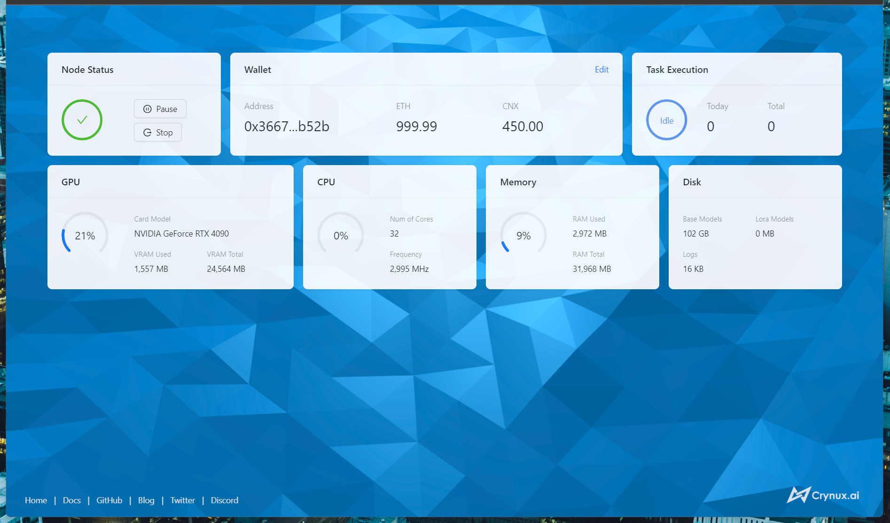

**NOTE: If you don't need to change the code, please use the prebuilt packages to start the node:**

[Start a node on Windows](https://docs.crynux.ai/node-hosting/start-a-node-windows)

[Start a node on Mac](https://docs.crynux.ai/node-hosting/start-a-node-mac)

[Start a node using Docker](https://docs.crynux.ai/node-hosting/start-a-node-docker)


# Crynux Node for the Helium(He) Network

Start a Crynux Node to share the spared local GPU to others in exchange for tokens. Crynux Node will join the Crynux Network, receive the AI inference/training/fine-tuning tasks from the network, and execute them locally.



## Start the node from source code

### Prepare the config file

Copy ```config/config.yml.shell_example``` to ```config/config.yml```. And adjust the file content according to your need:
```shell
# In the root folder of the project
$ cp config/config.yml.shell_example config/config.yml
```

### Prepare the server venv

1. Create the venv in the root folder of the project:

```shell
# In the root folder of the project
$ python -m venv venv
```

2. Activate the venv and install the requirements:

```shell
# In the root folder of the project

# Use ./venv/Scripts/Activate.ps1 on Windows
$ ./venv/bin/activate

# Use requirements_macos.txt on Mac
(venv) $ pip install -r ./requirements_docker.txt
(venv) $ pip install .
```


### Prepare the worker venv

1. Get the source code of stable-diffusion-task and gpt-task using Git submodule:

```shell
# In the root folder of the project
$ git submodule update --init --recursive
```

2. Create a folder named "worker" under the root folder of the project, and copy ```src/crynux_worker_process.py``` to the folder:

```shell
# In the root folder of the project

$ mkdir worker
$ cp src/crynux_worker_process.py worker/
```
3. Create the venv under the worker folder:

```shell
# In the root folder of the project

$ cd worker
$ python -m venv venv
```

4. Activate the venv and install the requirements for stable-diffusion-task and gpt-task:

```shell
# In the worker folder

# Use ./venv/Scripts/Activate.ps1 on Windows
$ ./venv/bin/activate

# Install the stable-diffusion-task package
(venv) $ cd ../stable-diffusion-task

## Use requirements_macos.txt on Mac
(venv) $ pip install -r requirements_cuda.txt
(venv) $ pip install .

# Install the gpt-task package
(venv) $ cd ../gpt-task

# Use requirements_macos.txt on Mac
(venv) $ pip install -r requirements_cuda.txt
(venv) $ pip install .
```
### Prepare the WebUI
1. Prepare the config file
```shell
# Go to the root folder of the webui
$ cd src/webui

# Create the config file from the example
$ cp src/config.example.json src/config.json
```

2. Build the WebUI distribution package

```shell
# In the root folder of the webui

# Install the dependencies
$ yarn

# Build the package
$ yarn build
```

### Start the node

Activate the server's venv, and start from the ```src/app/main.py``` script:

```shell
# In the root folder of the project

# Use ./venv/Scripts/Activate.ps1 on Windows
$ ./venv/bin/activate

(venv) $ python src/app/main.py
```


## Build the Docker image from the source code

1. Clone the project

```shell
# git clone https://github.com/crynux-ai/crynux-node.git
```

2. Go to the root folder of the project

```shell
# cd crynux-node
```

3. Build the Docker image

```shell
# docker build -t crynux-node:dev -f .\build\Dockerfile . 
```

4. Start the container

```shell
# docker run -d -p 127.0.0.1:7412:7412 --gpus all crynux-node:dev
```

## Build the binary package on Mac

Please refer to the [README](https://github.com/crynux-ai/crynux-node/blob/main/build/macos/README.md) for the detailed instructions on building the MacOS binary package.


## Build the binary package on Windows

Please refer to the [README](https://github.com/crynux-ai/crynux-node/blob/main/build/windows/README.md) for the detailed instructions on building the Windows binary package.

## Run tests

1. Clone the project

```shell
# git clone https://github.com/crynux-ai/crynux-node.git
```

2. Go to the root folder of the project

```shell
# cd crynux-node
```

3. Install the dependencies and package (preferably in a virtualenv)

```shell
# pip install -r requirements_docker.txt && pip install .[test]
```

4. Run tests 

```shell
# pytest tests
```
